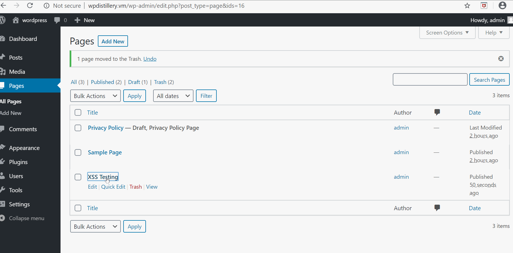
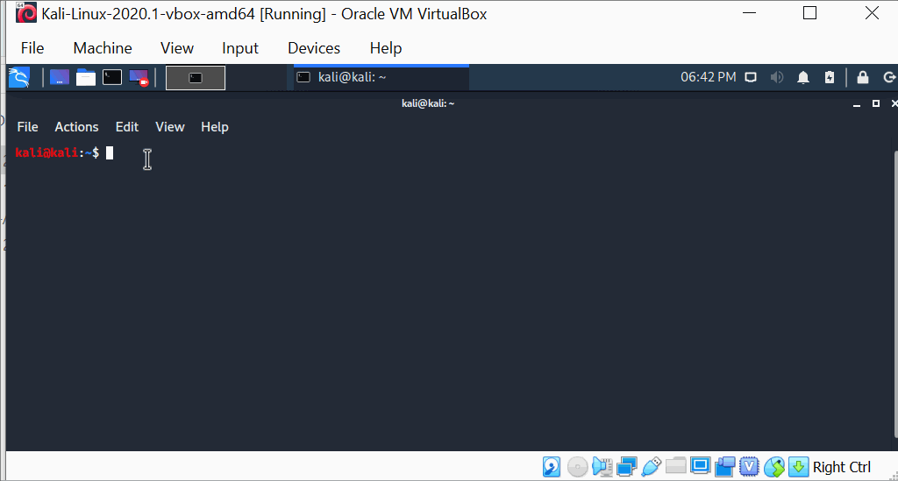

# Assignment 7-Pentesting
1. Wordpress: XSS(Authenticated)
   - Summary
      - Vulnerability type: Authenticated Cross site scripting
      - WP version: 4.2
      - HTML line: <a title=" onmouseover=alert('xss testing') ">title=" onmouseover=alert('xss testing')>link</a>
      - Steps: 
           - Wrote the above html code to post a link in a page with admin privilege
           - Saved it and the link is posted on the admin's page
           - Admin hovers on the link posted and the exploit is triggered
   - Gif walkthrough
         
 
 
 2. Wordpress: XSS(unauthenticated)
    - Summary
         - Vulnerability type: user enumeration
         - WP version: 4.2
         - HTML line: 
         - Steps: 
             - Wrote the above html code in comment for a post
             - A user views the comment and hovers on the link, the exploit is soon triggered
           
 .gif)
 
 3. Kali WPscan
    - Summary
       - Vulnerability type: User Enumeration
       - Kali command: wpscan --url http://wpdistillery.vm --enumerate u
       - The above command on kali will brite force the user login information
       
 
